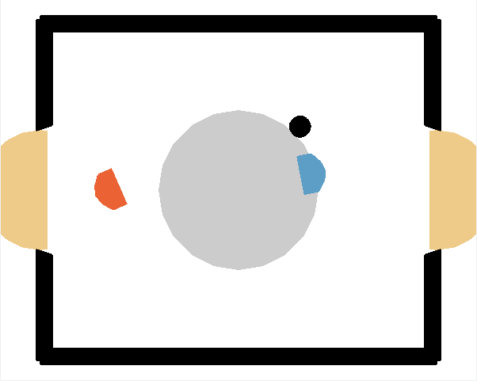
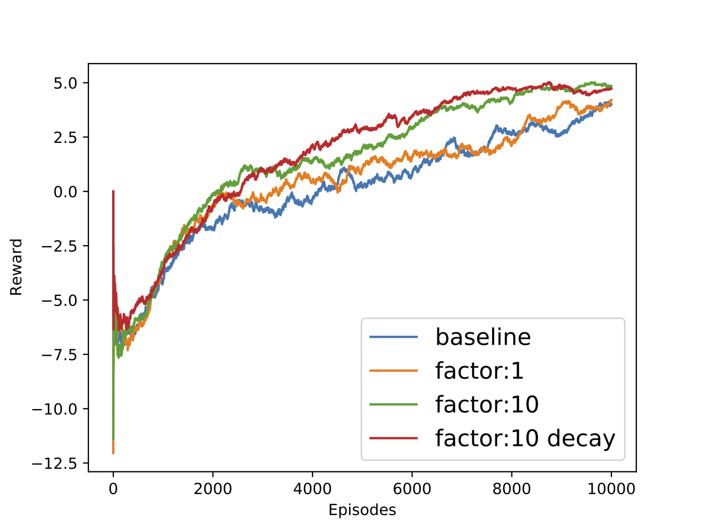

# Reinforcement Learning for Air Hockey

This repository contains the code as well as the evaluation for the final challenge of training a Reinforcement Learning agent to compete against other students in a game of Air Hockey. The challenge was part of the RL lecture from [Georg Martius](https://is.mpg.de/person/gmartius) that I took. I choose to implement the popular TD3 algorithm with a few problem specific modifications. One problem were sparse rewards, which is why I added a closeness to puck reward, leadinh to a faster converges as can be seen:

